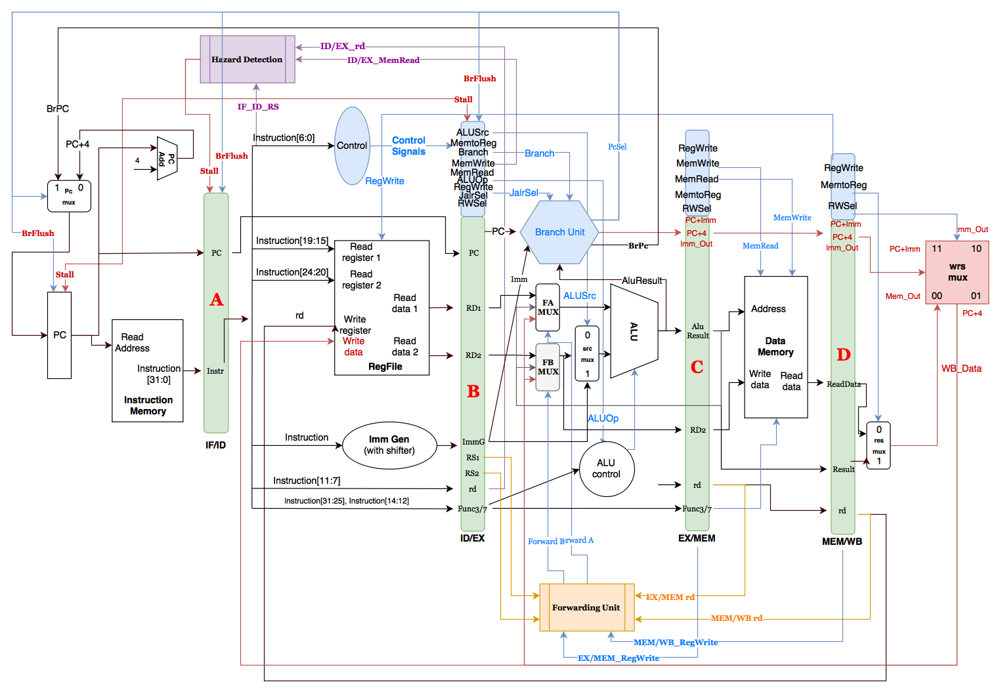

# RISC-V流水线实现实验

要求：实现一个五级流水的RISC-V处理器。框图如下：

## 相关文件使用说明
- `design`: 包含源码的文件夹。同学们此次实验主要修改这里的文件。
- `sim.do`: 创建work库，编译源代码，将设计加载到模拟器，启动模拟的全部流程
- `compile.do`：用于编译源代码，会被`sim.do`调用
- `insn.txt`: 输入待测试的文件
- `reg_trace.txt`: 模拟时自动生成的寄存器修改记录，将用于检验流水线实现是否正确。